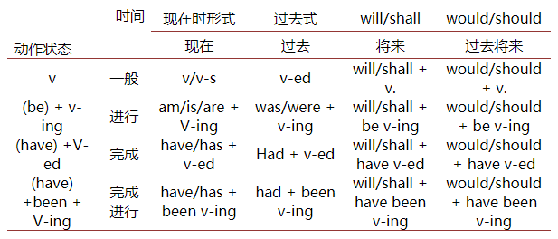

> 先有语法的表现形式(句子) 然后有的语法.
> 为了表明词法所无法表明的额外的信息 我们就要引入额外的手段 将这种手段系统化 便是语法

时体可以通过词汇的形式也可以通过语法组合的形式表达出来,
动词是时间的隐喻 名词是空间(物质/心理)的隐喻  
时描述的时动作在时间中占据的位置 (过去,现在,将来)
时反应说话人所关心的时间（不是动作发生的时间！），由限定动词（谓语动词词组第一动词）表示。英语时态有四个时：现在、过去、将来和过去将来，分别由动词的现在式、
过去式、will (do), would (do)来表示

体描述的是动作的状态 完成 未完成   
体反映在说话人关心的那个时间动作或状态为何种情况。英语有四个体，分别为一般体、进行体、完成体和完成进行体。一般体无标记，不是其它三种体的动词形式就是一般体，就像不是被动语态的动词形式就是主动语态一样。进行体、完成体和完成进行体分别由be doing, have done, have been doing表示

**体多出来一个动词来用表示时**

# 动词属性
当我们讲动词属性时我们在说动词所具有的通性 interface trait,一个合乎语法的真实使用的句子中的动词必定是下述属性中的特例化结果
时态
语体
语态
语气
静态/动态
# 时态

# 谓语动词语态
一般式的被动语态：be + v-ed；

进行式的被动语态：be + being + v-ed；

完成式的被动语态：have + been + v-ed。

无完成进行式的被动语态，其原因在于逻辑冲突，即如果存在完成进行式的被动语态，根据被动语态的公式，可推导出其形式为“have been being v-ed”，在一个形式中同时出现be的过去分词和现在分词。而过去分词表达被动完成的意义，而现在分词表达主动进行的概念，所以会发生逻辑混乱。这也是为什么没有完成进行式的被动语态的原因。

现代语法 二时二体
过去时 现在时
完成体 将行体
倾向于认为英语中没有将来时 将来/过去将来 不在是通过动词屈折变化来表达信息

[英语时、体、态特征研究](https://www.hanspub.org/journal/PaperInformation.aspx?paperID=29584)

[英语的时与体的概念](http://ask.yygrammar.com/q-23444.html)