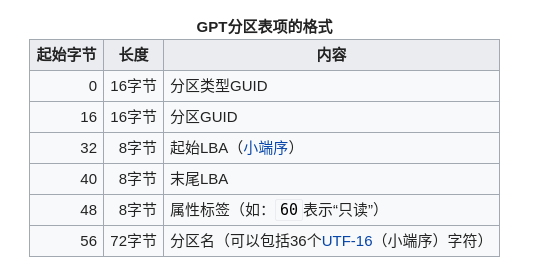

# 流程
## legacy
>1. BIOS加电自检（Power On Self Test -- POST）。
>2. 读取主引导记录（MBR）。BIOS根据CMOS中的设置依次检查启动设备：将相应启动设备的第一个扇区（也就是MBR扇区）读入内存。
检查MBR的结束标志位是否等于55AAH，若不等于则转去尝试其他启动设备，如果没有启动设备满足要求则显示"NO ROM BASIC"然后死机。
>3. 当检测到有启动设备满足要求后，BIOS将控制权交给相应启动设备的MBR。
根据MBR中的引导代码启动引导程序。

## uefi
>This is the mechanism the UEFI spec provides for operating systems to make themselves available for booting: the operating system is intended to install a bootloader which loads the OS kernel and so on to an EFI system partition, and add an entry to the UEFI boot manager configuration with a name – obviously, this will usually be derived from the operating system’s name – and the location of the bootloader (in EFI executable format) that is intended for loading that operating system.

>Linux distributions use the efibootmgr tool to deal with the UEFI boot manager. What a Linux distribution actually does, so far as bootloading is concerned, when you do a UEFI native install is really pretty simple: it creates an EFI system partition if one does not already exist, installs an EFI boot loader with an appropriate configuration – often grub2-efi, but there are others – into a correct path in the EFI system partition, and calls efibootmgr to add an appropriately-named UEFI boot manager entry pointing to its boot loader. Most distros will use an existing EFI system partition if there is one, though it’s perfectly valid to create a new one and use that instead: as we’ve noted, UEFI is a permissive spec, and if you follow the design logically, there’s really no problem with having just as many EFI system partitions as you want.

>If you boot the installation medium in ‘UEFI native’ mode, it will do a UEFI native install of the operating system: it will try to write an EFI-format bootloader to an EFI system partition, and attempt to add an entry to the UEFI boot manager ‘boot menu’ which loads that bootloader.

简单的讲在安装操作系统时安装程序更新EFI variable  将bootloader 的efi的地址写到bootxxx中
启动时UEFI 根据 EFI variable  bootorder 获取启动顺序
```
BootOrder: 0002,0000,0001
```
然后根据bootnumber 找到对应的EFIvariable 例如Boot0002
```
Boot0002* ubuntu	HD(2,GPT,a7192ef2-c2c8-4af3-b7e7-e7fe408b5345,0xfa000,0x32000)/File(\EFI\UBUNTU\SHIMX64.EFI)
```
从中可以获取到.efi文件所在的分区和具体的文件名 执行之
# EFI variable存放在哪里?
存在主板上是一个单独的位置
## 如果有多个esp分区怎么办?
>when we create multiple partitions with the ESP’s GUID and label, there’s no requirement that the firmware looks at more than one of them if it needs to find the ESP, and there’s no guarantee as to which one it will pick, either.  --[the-efi-system-partition](https://blog.uncooperative.org/blog/2014/02/06/the-efi-system-partition/)
## efibootmgr -v
Boot0002* ubuntu	HD(2,GPT,a7192ef2-c2c8-4af3-b7e7-e7fe408b5345,0xfa000,0x32000)/File(\EFI\UBUNTU\SHIMX64.EFI)
指明了efi文件的路径 

# EFI variable 


# UEFI
如何知道电脑是否是UEFI?
# 查看boot 
efibootmgr
# 在操作系统中更改bootorder
## 实验
### 如何知道一个磁盘是否为可引导磁盘?
### 多个硬盘 如何知道哪一个是当前使用的引导盘
### MBR和GPT是什么 区别是什么
MBR和GPT都是分区解决方案
分区是磁盘的逻辑组成概念
假设对于磁盘的理解为一个大数组 分区则给予了拆分这个大数组的能力 文件系统建立在分区上 不同分区可以装不同的文件系统
为了维护分区 分区的meta-info也是存在磁盘上需要有方法格式来设定:即为MBR和GPT
此外系统加载时操作系统的bootloader也是存在操作系统上的 如何boot操作系统的逻辑也是由MBR和GPT负责的

MBR是分区与引导方案的集合

标识一个分区 MBR使用16字节 4字节起始扇区 + 4字节扇区大小
分区最大2^32*512/1024/1024/1024=2048 2T
标识磁盘最大4T
# MBR格式
固定512byte大小 包含bootloader代码和分区表 分区表固定大小64byte 分区项固定大小16byte 通过4字节起始扇区和4字节扇区大小标识分区
MBR中	CHS First address 和 CHS Last address 应当是冗余的

# GPT格式

思路上设定就不一样 MBR在512byte中完整的表达中了所有分区的信息(不算额外分区)
GPT到更类似于指针在LBA1(GPT分区表头)中存放着分区的数量和分区项的大小,在后面是分区项 分区项结束后是真正的分区数据
在最后还有一个备份的GPT分区表
分区表 不固定大小
分区项由表头指定大小 一般128byte 通过8字节起始扇区和8字节结束扇区标识分区




# 如何确认一块磁盘是否是GPT分区
GPT表头有magicnumber
# 对于一块磁盘的概念划分
1. 硬件属性
2. 软件属性
    1. 分区信息
    2. 建立在分区上的文件系统信息

# GRUB2

## reference
https://blog.uncooperative.org/blog/2014/02/06/the-efi-system-partition/
https://www.happyassassin.net/2014/01/25/uefi-boot-how-does-that-actually-work-then/