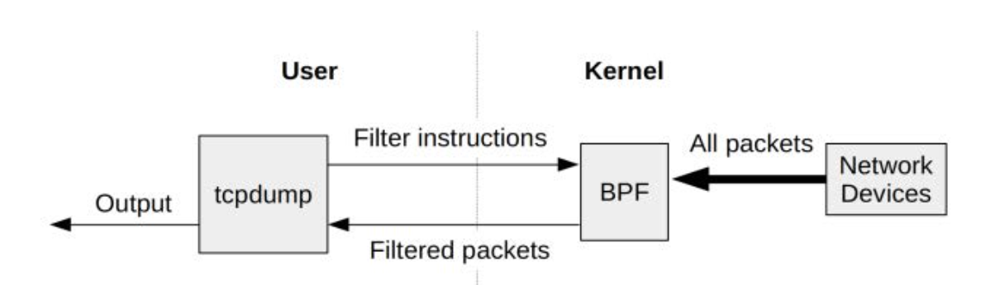
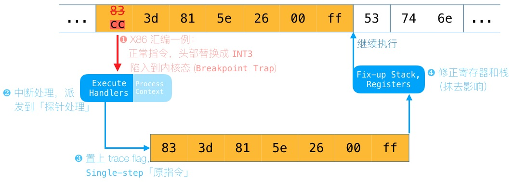
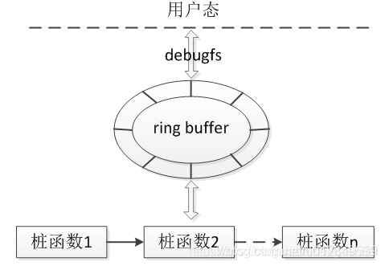
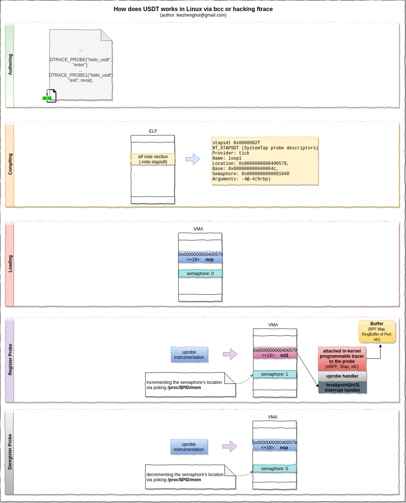
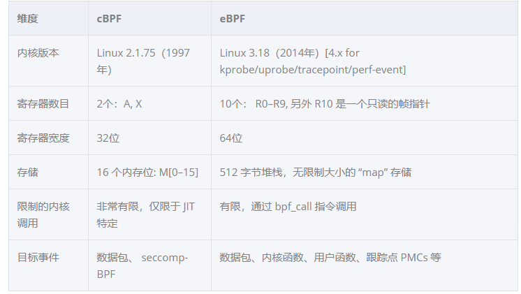
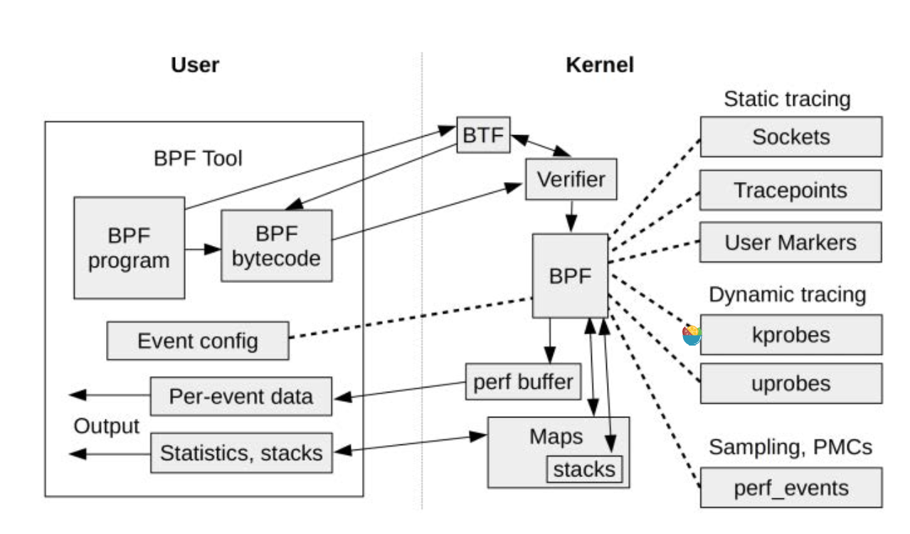
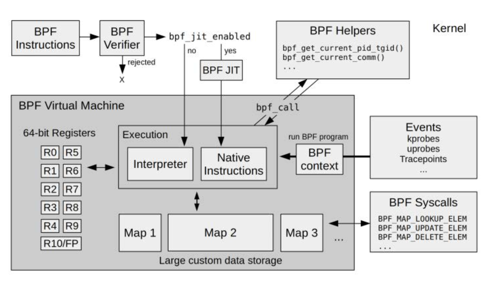
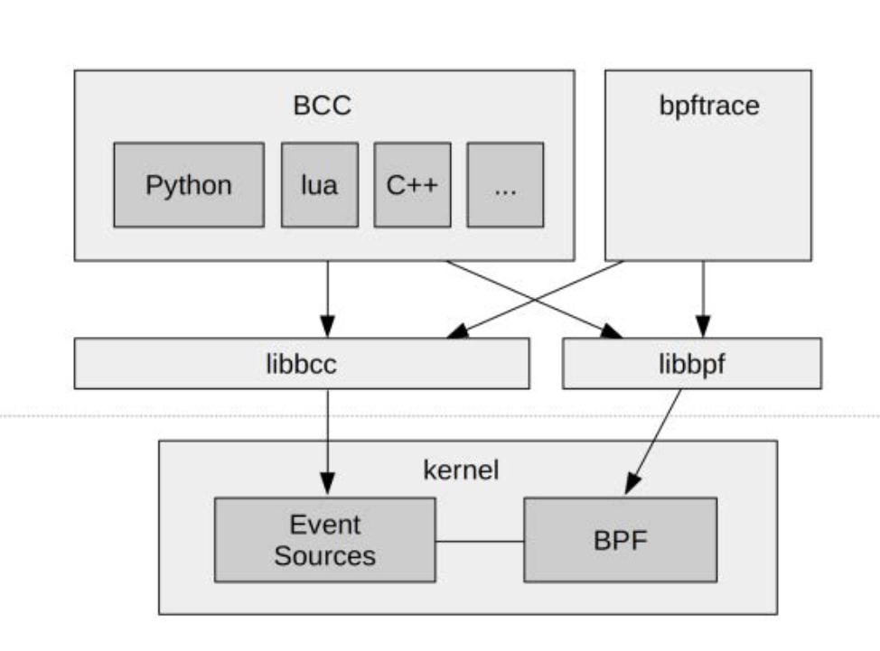

<!-- slide -->
## 什么是可观测性


对于一个苹果，我们说他是可观测的，当我们看着这个平果的时候
我们能够从中观察的到一些信息，例如

1. 颜色
2. 大小
3. 形状
4. 斑纹

如果是有经验的果农能还能知道苹果的品种，甜度，口感.

可观测性指的就是对于一个给定的物体，你能够通过各种手段进行观察，从而从中获取到更多的信息，从而加深对其的理解
<!-- slide -->
## Linux 可观测性


一个正在运行的操作系统,抽象的看大致由CPU 调度器/网络调度器/文件系统调度器三大部分组成，每个部分又通过各种系统调用为用户态程序提供接口。对于 linux 系统的观测，很大一部份就是对于这些模块的观测，问题在于，如何去观测？这次介绍的 EBPF 就为这种观测能力提供了手段
<!-- slide -->
## 从BPF说起
需求： 网络包 过滤/监控
### BPF工作流程

对于一个网络包 如果通过bpf过滤则保留,不满足则drop.
### 实现
1. 内核虚拟机
2. JIT编译

### BPF历史
1. 1992论文 `<<A New Architecture for User-level Packet Capture>>`
2. 1997 linux 2.1.75 add bpf
3. 2011 linux 3.0 jit

<aside class="notes">
讲到EBPF 这个E指的实际上是extend也就是加强版的意思,要了解整个EBPF的历史,就要从BPF开始讲起.  
有一种需求是对流经整个系统的网络包做监控和过滤   
在1992年有篇论文提出这种过滤/捕获网络包的方法.大致上就是如图所示,用户将过滤指令发到内核的一个虚拟机上,网络包通过虚拟机执行一遍，做出接受还是drop的判断从而过滤网络包,我们常用的tcpdump和wirehshark实际使用的就是这种方式。  
</aside>
* 在1997年linux 2.1.75的时候种bpf被merge Linux内核  
* 在2011年linux 3.0 发布,实现了一个BPF虚拟机的优化,JIT就是虽然我们有虚拟机这个概念,但虚拟机的指令集会被JIT优化成机器码进行执行.  

<!-- slide -->
### 工作模型

事件源(网络包)=>虚拟机=>(accept/drop)
<aside class="notes">
如果我们回过头来看这个BPF的工作模型,大概是这个样子
事件源现在也就是网络包经过虚拟机的判断,得出了一些结果,这里就是接受或者丢弃网络包
</aside>
<!-- slide -->

## 事件源为什么一定是网络包?

<aside class="notes">
但事件源为什么非得是网络包呢?仔细想想整个系统中有很多可以成为事件源的东西
</aside>

<!-- slide -->

## 事件源(linux hook)
### KPROBE 
linux内核空间系统调用,每一个内核态系统调用可以是一个事件源
### UPROBE
linux用户空间(应用程序)调用,每一个用户态函数调用可以是一个事件源
### trace-point
custom trace event,linux内核可以自定义事件
### USDT
用户程序可以自定义事件
### PMC 性能计数器(Performance monitoring counters)
CPU的性能采样计数器
1. L1缓存成功/失败率
2. 分支预测成功/失败率

<aside class="notes">
下面我会给大家简要介绍一下这几种事件源的原理
</aside>

<!-- slide -->
## KPROBE/UPROBE 原理
动态的改变linux内核指令流,插入一个int3指令(x86)从而跳转到probe逻辑.


1. 通常来讲我们常见的hook点是函数入口和函数结束
2. 因为kprobe通常被设置在函数入口点,所有我们也可以通过寄存器获取到这个函数的参数

<aside class="notes">
kprobe和uprobe实际上是Linux提供的一个动态指令的技术.他实际上提供的是对内核空间的任何指令加上pre和post handle的能力.    

具体的工作流程大概是
1. 保存要插入hook的指令,并替换成一个断点指令(int3)
2. 程序执行到这个指令时会进入到断点处理流程中,其实就是执行我们注入的pre_handle
3. 执行完pre_handle后,设置CPU为单步执行模式,在这种模式下,执行完一个指令就会又陷入到中断处理中,同时将下一条指令设置为我们之前保留的原指令
4. 重新进入中断,执行post_handle 修复寄存器和栈
</aside>
<!-- slide --> 


### trace-point原理


<aside class="notes">
trace point 也是内核提供的一个hook机制,不过不同于kprobe,这些hook的点时人手工埋进去的
他大致的工作流程就是
1. 调用函数注册hook到hook队列中
2. 执行到相应trace-point 在事件处理的队列中依次执行
</aside>

不同于kprobe  
1. tracepoint是内核代码中硬编码的,采用的是自己的一套注册hook的机制
2. tracepoint比较稳定

<!-- slide --> 
### USDT原理


<aside class="notes">

USDT的工作原理实际上可以说时结合kprobe和trace point的特点
首先它是人手动在代码中的埋点,其次也使用probe的断点处理的方法
1. 在代码中手动指定要加入的tracepoint
2. 编译时这些trace point会被编译成noop空指令 并在ELF头中记录下这些指令的位置
3. 如果真的要去追踪这些trace point uprobe会找到这些noop空指令将他们变成断点指令 然后就跟之前介绍的机制一样了
</aside>
<!-- slide --> 

## traceing system 历史


<aside class="notes">

有几个比较重要的节点
1. 2004年 linux kprobe被merge到内核
2. 2014 ebpf补丁被merge到内核，就是这个补丁，将BPF变成了EBPF
</aside>

<!-- slide --> 
## 处理流程为什么一定是简单的匹配?

事件源(kprobe/uprobe/tracepoint/usdt)=>虚拟机=>(?)
<!-- slide --> 
## 虚拟机对比

<!-- slide --> 
## EBPF 工作流程


<aside class="notes">
这张图大概描述了EBPF的工作流程，用户的BPF程序被编译成BPF字节码，在内核中首先通过校验器的校验，这一步能够保证EBPF程序是安全的，不会break掉内核。然后在各种事件发生的时候调用
</aside>


<!-- slide --> 
## EBPF 工作流程


<aside class="notes">
这个是更详细一点的内核态的EBPF工作流程，如果开启了JIT的话BPF虚拟机指令会再被编译成机器码执行
</aside>

<!-- slide --> 

## BCC/BPFtrace lib

1. LLVM
2. bcc
3. BPFtrace

<aside class="notes">
LLVM现在也支持BPF做为后端，所以理论上我们可以用任何支持LLVM的语言来写BPF
</aside>
<!-- slide --> 

## BPFTRACE a lang for trace
```bpftrace
#!/usr/local/bin/bpftrace
// this program times vfs_read()
kprobe:vfs_read
{ 
        @start[tid] = nsecs;
}

kretprobe:vfs_read
/@start[tid]/
{        
    $duration_us = (nsecs - @start[tid]) / 1000;
    @us = hist($duration_us);
    delete(@start[tid]);
}
```
但作为日常的使用，实际上我们还可以使用一种bpf特有的脚本语言
基本有三部分组成
1. hook
2. 对map的访问/基本条件控制语法
3. bpf帮助函数

<!-- slide --> 
## EBPF限制
1. 循环次数 不能使用无限循环
2. 堆栈大小限制
3. 指令数限制 1百万条指令
<!-- slide -->

## EBPF其他用处
* SDN 软件定义网络  Cilium 基于EBPF实现的kube-proxy

<!-- slide -->

## lab
### bcc tools
1. execsnoop
2. biolatency

### bpftrace kernel mode
1. 列出所有可以被设置trace的函数
```bash
sudo bpftrace -l '*kprobe*'
```
2. 跟踪udp协议 显示域名
```bash
sudo gethostlatency
```
### bpftrace uprobe bash readline
```
sudo bpftrace -e 'ur:/bin/bash:readline { printf("%s\n", str(retval)); }'
```