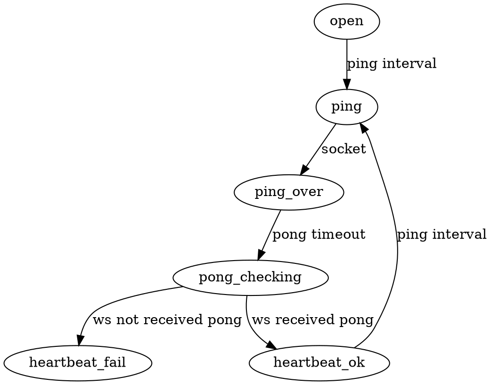

本质上讲socket-io-client就是在websocket上进行了薄薄的封装.最简client代码如下
```js
const WebSocket = require("ws");
const EngineIoParser = require("../../../engine.io-parser");
const SocketIoParser = require("../../../socket.io-parser");

const ws = new WebSocket(
  "ws://localhost:3000/socket.io/?EIO=3&transport=websocket"
);
let config = {};
ws.on("close", () => {
  console.log("ws close");
});

ws.on("open", function open() {
  console.log("ws open");
});

ws.on("message", data => {
  const engineIoPacket = EngineIoParser.decodePacket(data);
  console.log("on msg", data,engineIoPacket);

  if (engineIoPacket.type === "open") {
    console.log("on open", engineIoPacket);
    config = JSON.parse(engineIoPacket.data);
  } else if (engineIoPacket.type === "message") {
    console.log("on message");
    const socketIoPacket = SocketIoParser.decodeString(engineIoPacket.data);
    console.log("socketIoPacket",engineIoPacket, socketIoPacket);
    if (socketIoPacket.type === SocketIoParser.CONNECT) {
    console.log("socketIoPacket", socketIoPacket,"connect");
      onConnect(ws);
      ping(ws);
    } else if (socketIoPacket.type === SocketIoParser.EVENT) {
      onReceEvent(ws, {
        name: socketIoPacket.data[0],
        data: socketIoPacket.data[1]
      });
    }
  } else if (engineIoPacket.type === "pong") {
    console.log("on pong");
    ping(ws);
  }
});

function buildPingPacket(packet) {
  return EngineIoParser.encodeStringPacket({ type: "ping" });
}

function buildCustomEventPacket({ name, data }) {
  const packet = {
    type: SocketIoParser.EVENT,
    data: [name, data],
    options: { compress: true },
    nsp: "/"
  };
  const encoded = SocketIoParser.encodeAsString(packet);
  return EngineIoParser.encodeStringPacket({ type: "message", data: encoded });
}

function sendEvent(ws, name, data) {
  ws.send(
    buildCustomEventPacket({
      name,
      data
    }),
    { compress: false }
  );
}
function onConnect(ws) {
  sendEvent(ws, "event", "lalala test send to server");
}

function onReceEvent(ws, { name, data }) {
  console.log("onReceEvent", name, data);
}

function ping(ws) {
  setTimeout(() => {
    const pingPacket = buildPingPacket();
    console.log("ping",pingPacket);
    ws.send(pingPacket, { compress: false });
  }, 1000 * 3);
}

```
因此理论上来讲只要有websocket库实现socket-io client应该不是一件难事 然而今天最起码花费了我大概4-5小时时间 成功卡住了 不得不重头来开始调研缺失的知识 主要就是tokio的使用
socket-io的连接过程大概是websocket连接到server,server返回id和连接参数,然后server向client发送open事件,client响应open事件根据连接参数设置定时器去发送ping请求给server,server接收到ping立即发pong回来,所谓的心跳机制实际上就是这个不断重复的ping-pong的过程,但server端的pong没有在给定时间内发送过来时,客户端就会触发超时事件.

rust的websocket库 [websocket](https://docs.rs/websocket/0.22.4/websocket/)的异步接口将websocket抽象成feature stream 我的想法大概同样 将socket-io 同样抽象成feature stream,对于stream做map应该不是问题,但如何完成心跳是我现在苦恼的地方.


## tokio
我对于tokio future 的理解大概就是 future代表的是通过结构封装起来的函数执行顺序 tokio每次会去poll这个future一次,每次都会导致future内部的变化,使其从NotReady到Ready状态.同时提供了一些异步实现例如文件IO,网络流等.每次pollfuture时实际上没有等待IO的阻塞操作,例如当调用read_file时如果read_file返回的是NotReady那么就直接去poll下一个future了 等到操作系统通知文件读取完毕再去poll一次这个future 这时read_file的返回值就是Ready(Data)这样来达到无阻塞的目的.mio库封装了操作系统文件读取等的回调.
## 问题1. 谁去pull future again?
```rust
fn main() {
    let mut runtime = tokio::runtime::current_thread::Builder::new()
        .build()
        .unwrap();
    runtime.block_on(run().unwrap()).unwrap();
}

fn run() -> Result<impl Future<Item=(), Error=failure::Error>, Error> {
    let res = SocketIoStream {}
        .for_each(|event| {
            println!("socket-io event {:?}", event);
            Ok(())
        }).into_future();
    Ok(res)
}

impl Stream for SocketIoStream {
    type Item = SocketIoEvent;
    type Error = Error;

    fn poll(&mut self) -> Result<Async<Option<Self::Item>>, Self::Error> {
        info!("ss poll");
        Ok(Async::NotReady)
    }
}
```
会发现只打了一次log,这就是之前提到的future只会被pull一次的导致的,我们必须将这个future与某些事件关联起来,当发生这些事件时,重新来poll一次future才能使这个状态机从初始状态转化为终结状态
## timeout
正如之前的介绍 心跳机制事件上是一系列定时触发的回调,也就是一堆状态机只不过触发状态变化的是timer


## 问题2. 写法与Js的Promise有何不同